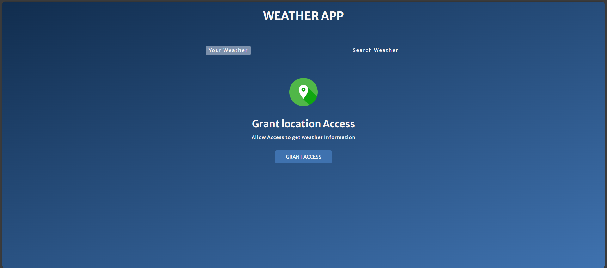

# Weather website
A responsive and interactive **Weather App** built with **HTML**, **CSS**, and **JavaScript** that fetches real-time weather data from the **OpenWeatherMap API**. Users can either allow geolocation to view their current weather or search for any city worldwide.
## Features
-  Get weather details using **browser geolocation**
-  **Search** for weather by **city name**
-  **Loading animation** while data is being fetched
-   Displays:
  - City & country (with flag)
  - Weather description
  - Temperature (°C)
  - Wind speed
  - Humidity
  - Cloudiness
-  Saves user coordinates in **session storage**
-  Responsive layout for mobile and desktop

## About
Weather App is a responsive, user-friendly web application that allows users to check the current weather of their location or any city in the world. Built using HTML, CSS, and JavaScript, the app fetches real-time weather data from the OpenWeatherMap API.

---

##  Features
- Your Weather: Automatically detects and shows weather for your current location using browser geolocation.
- Search Weather: Lets users search weather for any city worldwide.
- Real-Time Weather Data: Shows temperature, weather description, wind speed, humidity, and cloudiness.
- Geolocation Permission Prompt: Gracefully prompts users to grant location access.
- Responsive Design: Fully responsive and mobile-friendly UI.
- Loading Animation: Displays a loading spinner while fetching weather data.

## Technologies Used
- HTML5
- CSS3 (Flexbox + Responsive Design)
- Vanilla JavaScript (ES6+)
- OpenWeatherMap API

## How It Works
- When the user opens the app, it tries to get the user's location via the Geolocation API.
- If access is granted, the app fetches the weather data using latitude and longitude from OpenWeatherMap.
- Users can also search for a city by name, which triggers another API call.
- Weather data is then displayed using a clean and structured UI.